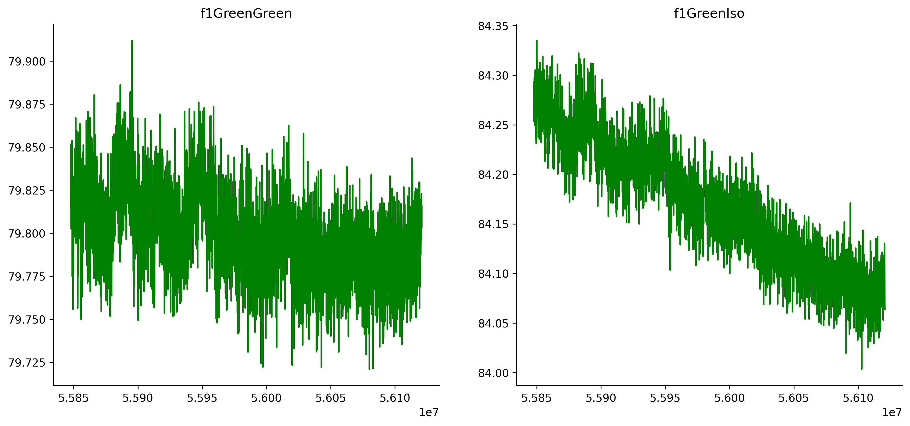
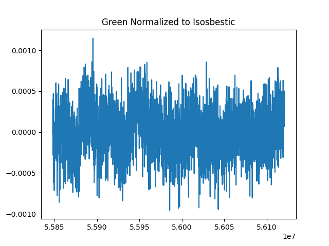
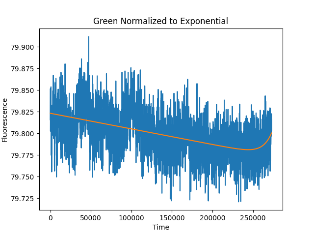

# Donaldson Lab Fiberphotometry Analysis
> This software is for performing analysis on animal fiberphotemetry and behavior data 

In order to use this code you must have collected fiberphotometry data using `Bonsai` and behavior data using the behavior coding software `BORIS` (https://boris.readthedocs.io/en/latest/#behavioral-observation-research-interactive-software-boris-user-guide). 

### Note: this software is currently optimized for GcAMP (or other green fluorophores)


## Installation

Open a terminal and navigate to the working directory where you would like to store and use this software. Run the following command to download code from this repository into that directory. 

```sh
git clone https://github.com/anmc9115/swe4s_final_project_am_cp_js.git
```
Once you have cloned the repository, run the following command to install the conda environment and all program dependencies.
```sh
conda env create -f environment.yml
```

## To Use the Code
1. Obtain fiberphotometry data `msec/day`
2. If analyzing behavior, score behavior using BORIS with the events recorded in `seconds`
3. If analyzing behavior, download raw data from behavior scoring using BORIS by clicking: `observations -> export events -> tabular events -> select observations -> save as csv`
4. Download all analysis software as described in the `Installation` section above
5. Move into the Python subdirectory by typing the following command into a terminal window (only works relative to main directory)
```sh
cd Python
```
6. Open and edit the `config.yml` file with the parameters specific to your experiment. You will need to edit this file each time you want to run the code.
7. In the command line, run the following command to execute the code:
      `python fpho_config.py --config config.yml`
8. A summary excel file along with any plots from analysis will be output to the working directory.   
\* *See below for general file structure*

## Example Plots
### Raw Signal Trace
<center></center>

### Normalized Signal to Isosbestic
<center></center>

### Normalized Signal to Biexponential Fit
<center></center>

## File Structure

### Main directory
* .travis.yml: File that allows continuous integration through Travis-CI.com   
* Environment.yml: Used to set up environment on user computer  

### Python subdirectory
#### Folders
* **ExamplePlots**: Example output PNGs from plotting functions
* **SampleData**: Input fiber photometry and behavior data examples
* **TestData**: Data file used for unit tests
* **Synchrony data**: Behavior data

#### Files

*Fiber photometry files*
* **fpho_setup.py**: Library of functions used to parse and plot fiber photometry data
* **fpho_config.py**: Runs functions in fpho_setup.py using config.yml
* **config.yml**: File specifying positional arguments for all functions implemented in fpho_config.py

*Unit test files*
* **test_fpho_setup.py**: Unit tests for functions in fpho_setup.py
* **unittest_fpho_setup.txt**: File that provides user input to unit tests. 

```sh
python Python/test_fpho_setup.py < Python/unittest_fpho_setup.txt
```

*Functional test files*
* **test_fpho_driver.sh**: Functional tests for functions in fpho_setup.py using Stupid Simple bash testing framework
* **fpho_ftest_driver.py**: File used to test functionality of fpho_setup.py functions in command line using Stupid Simple bash testing framework. Used by repository's software developers only.
* **fpho_ftest_driver_input.txt**: Provides responses to prompted user inputs in functional test file fpho_ftest_driver.py.
```sh
bash Python/test_fpho_driver.sh
```

*Behavior files (In development)*
* **behavior_setup.py**: Library of functions to import, parse, analyse, and plot behavior data.

*Old files--No longer in use*
* **fpho_driver_old.py**: This file became fpho_config.py. Kept for reference.

### Matlab subdirectory
* Analyses were originally developed in MATLAB and was then converted to Python. MATLAB files are no longer in use, and as such will not be listed here. 

## Release History

* v1.0
    * ADD: `fpho_setup.py` library that parses fpho data, contains analysis
    * ADD: functional and unit testing: `fpho_ftest_driver.py`, `fpho_driver.py`, `ftests_fpho_setup.txt`, `test_fpho_driver.sh`, `test_fpho_setup.py`, `unittest_fpho_setup.py`
    * ADD: `behavior_setup.py` library that parses behavior data, contains analysis
    * ADD: `config.yml` file manipulated by user to run the software
    * ADD: Example plots, sample and test data
